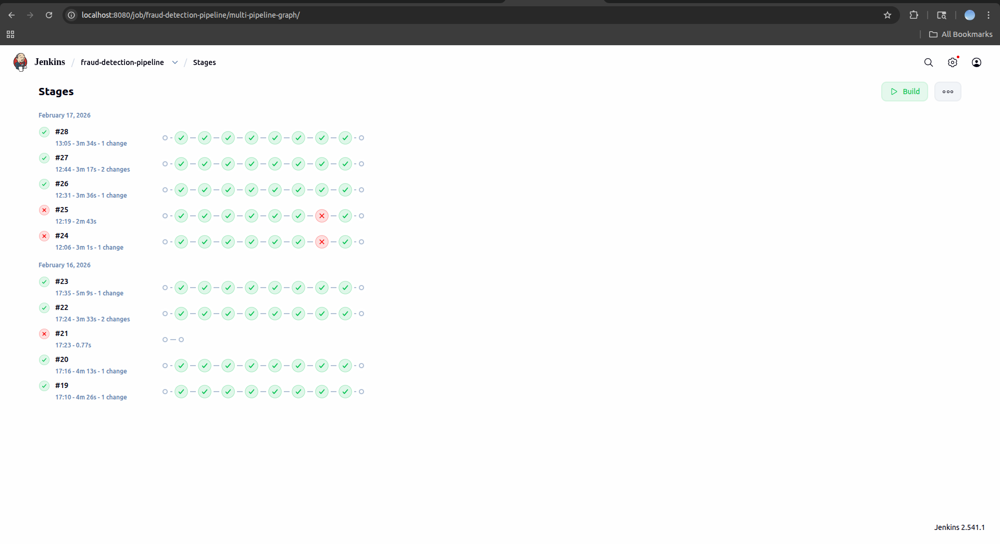
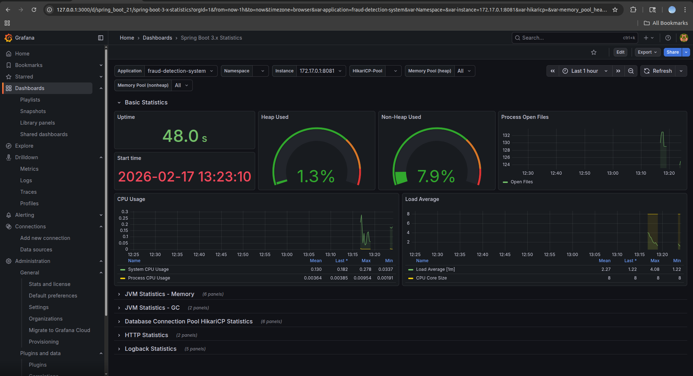
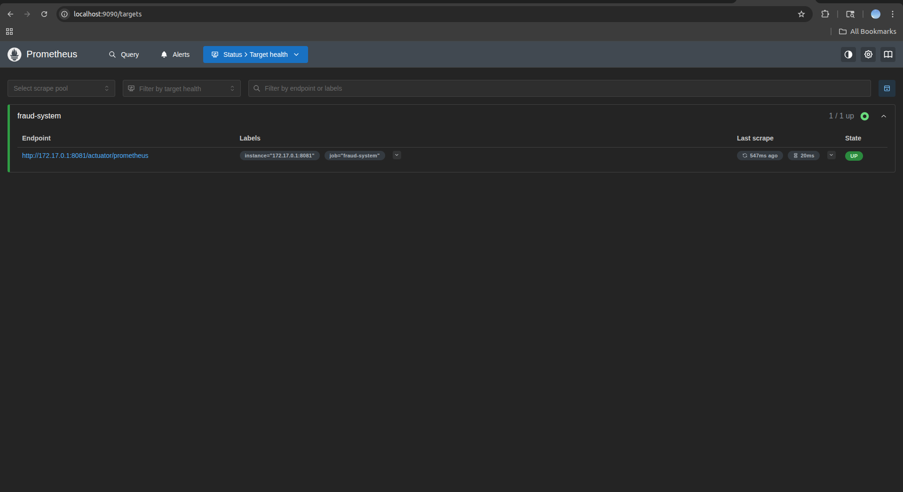
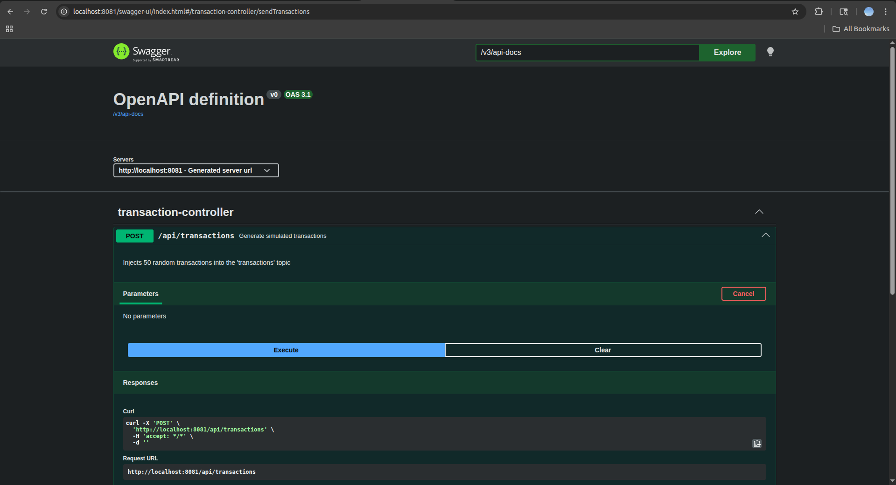

# 🛡️ Real-Time Fraud Detection Engine

[](https://spring.io/projects/spring-boot)
[](https://kafka.apache.org/documentation/streams/)
[](https://www.oracle.com/java/)
[](https://opensource.org/licenses/MIT)

A production-ready event-driven system built with **Spring Boot 3.5** and **Kafka Streams**. This project demonstrates a high-throughput architecture for financial safety, focusing on **Exactly-Once Semantics (EOS)**, real-time transaction filtering, and automated documentation via OpenAPI 3.

## 🚀 Key Features

- **Real-time Ingestion:** Leveraging Kafka Streams for low-latency analysis.
- **Resilience:** Integrated Resilience4j for circuit breaking and rate limiting.
- **CI/CD Ready:** Automated pipeline with Jenkins and Docker Compose.
- **Containerization:** Multi-stage Docker builds for minimal, hardened production images.
- **Automated Rollback:** Smart deployment logic that reverts to the last stable version if a build or health check fails.
- **Observability:** Full monitoring stack with Prometheus and Grafana.
- **API Documentation:** Interactive documentation via Swagger/OpenAPI.

---
### 🏛️ The Architecture Diagram: Full Lifecycle & Data Flow
This diagram demonstrates the end-to-end "Commit-to-Cloud" flow, including the internal state management of the Kafka Streams processor.

```mermaid
graph TD
    subgraph Ingestion_Layer [Banking Ingestion Layer]
        PGW[Payment Gateway / ATM] -->|ISO-20022 / JSON| K_In((Kafka: transactions-input))
        K_In -->|Event Stream| KS[Kafka Streams Engine]
    end

    subgraph Analysis_Layer [Stateful Fraud Analysis]
        KS -->|RocksDB| State[(Transaction History Store)]
        KS -->|Apply Rules| Logic{Fraud Scoring Engine}
        Logic -->|Circuit Breaker| R4J[Resilience4j]
        R4J -->|Verified| K_Out((Kafka: transactions-legit))
        R4J -->|Flagged| K_Alert((Kafka: fraud-alerts))
    end

    subgraph Infrastructure_Automation [CI/CD & Deployment]
        GH[GitHub Repo] -->|Webhook| Jenk[Jenkins Pipeline]
        Jenk -->|Maven Build| Test{Unit & Integration Tests}
        Test -->|Success| DH[Docker Hub]
        DH -->|Pull| Prod[Ubuntu Production Server]
    end

    subgraph Core_Banking_Services [Internal Banking Services]
        Logic -.->|OAuth2/OIDC| KC[Keycloak Identity Provider]
        Jenk -.->|Secret Management| GH_Sec[Vault / GitHub Secrets]
    end
   ```

---
### 🌐 Distributed System Diagram: Physical & Infrastructure View
This view focuses on the topology and the network isolation of the distributed components.

```mermaid
graph LR
    subgraph External_Network [External Banking Network]
        GW((Financial Gateway))
    end

    subgraph Internal_VPC [Secure Banking VPC]
        subgraph Service_Tier [Application Layer]
            App[Spring Boot Fraud App]
            Actuator[Health & Metrics]
        end

        subgraph Middleware_Tier [Message Backbone]
            K1[Kafka Cluster] <--> Z[Zookeeper Quorum]
            K1 <--> Storage[(Encrypted Persistent Volumes)]
        end

        subgraph Security_Tier [IAM & Security]
            KC[Identity Server]
        end
    end

    GW -->|mTLS / HTTPS| App
    App <-->|Internal Protocol| K1
    App <-->|OIDC| KC
    Jenk[Jenkins Master] -.->|SSH| App
```

---
## 🖼️ System Gallery

### CI/CD Pipeline (Jenkins)

*Automated workflow: Build, Unit Tests, Integration Tests (Testcontainers), and Docker Deployment.*

### Monitoring Dashboard (Grafana)

*Shows the system's performance and memory health.*

### Monitoring Prometheus (Prometheus)

*Proves the scraping connection is correctly configured.*

### API Verification (Swagger)

*Shows how to interact with the API.*

---
### Core Components

* **Transaction Producer**: A RESTful gateway that simulates high-frequency financial events, producing them into the Kafka cluster using `KafkaTemplate`.
* **Fraud Detection Stream**: The core processing engine. It leverages the **Kafka Streams API** to process, filter, and analyze transaction payloads in real-time.
* **Infrastructure Layer**: A containerized environment featuring **Confluent Kafka (7.1.0)** and **Zookeeper**, optimized for single-node development with transactional support.

---
## 🏗️ CI/CD Pipeline & DevOps Lifecycle
This project utilizes a "Commit-to-Cloud" workflow. Every push to the repository triggers an automated pipeline:

* **Secure Authentication:** Jenkins connects to GitHub via GitHub App Credentials (using PKCS#8 RSA keys).
* **Standardized Build:** Compilation occurs in a controlled environment using Maven 3.9.6 and OpenJDK 21.
* **Hardened Dockerization:** * Build Stage: Uses maven:3.9.6-eclipse-temurin-21-alpine.
* **Runtime Stage:** Uses eclipse-temurin:21-jre-alpine with a non-root user for enhanced security.
* **Automated Registry Push:** Verified images are versioned and pushed to Docker Hub.
* **Rollback Strategy:** The pipeline includes a failure-handling block. If the deployment or integration tests fail, the system automatically triggers a rollback to the previous stable Docker image tag, ensuring zero-downtime and system reliability.

---
## 🧪 Testing

The system implements a comprehensive testing strategy to ensure reliability under both normal and high-pressure conditions.

### Unit Tests
Validated using **Mockito**, these tests focus on isolated business logic.
* **Happy Path:** Validates that legitimate transactions are correctly identified and processed without triggering alerts.
* **Failure Cases:** Verifies that the system correctly identifies fraudulent patterns (e.g., negative amounts) and handles malformed JSON payloads.

### Integration Tests
Utilizing **Testcontainers**, these tests spin up an ephemeral Kafka broker to validate the full stream topology.
* **Happy Path:** End-to-end flow from the `transactions` input topic, through the Streams logic, to the `fraud-alerts` output topic.
* **Failure Cases:** Simulates infrastructure issues such as broker timeouts (`TimeoutException`) and verifies that the **Resilience4j Circuit Breaker** trips correctly to protect the application.

---
## 🛡️ Reliability & Advanced Features

This engine is engineered for banking-grade consistency and observability:

* **Exactly-Once Semantics (EOS)**: Configured with `exactly_once_v2` to ensure that every transaction is processed exactly once, even in the event of a broker or application failure.
* **Automatic Topic Management**: Uses Spring's `TopicBuilder` to programmatically provision the `transactions` and `fraud-alerts` topics.
* **Interactive API Documentation**: Fully integrated with **Swagger UI (SpringDoc)**, allowing developers to trigger and monitor transaction simulations visually.
* **Type-Safe Serialization**: Implements custom `JsonSerde` for seamless Java-to-JSON transitions within the Kafka pipeline.

---
## 🏗️ Technical Hardening: Resiliency & Security

This project follows standard hardening (**OWASP**, **NIST**) to ensure data protection, failure isolation, and infrastructure integrity through a **Zero-Trust** approach.

| Feature | Implementation Status | Tools / Technology |
| :--- | :--- | :--- |
| **Resiliency** | Failure Isolation & Retries | **Resilience4j** |
| **Security Scanning** | Automated Vulnerability Audits | **GitHub Actions, Snyk, Trivy** |
| **Static Analysis** | SAST for Logic Flaws | **GitHub CodeQL** |
| **API Protection** | Hardening & Rate Limiting | **Spring Security, Rate Limiter** |
| **Secret Management** | Zero-Leak Policy | GitHub Secrets, `.gitignore` |

### 1. Failure Isolation & Resiliency
* **Circuit Breakers**: Implemented via **Resilience4j** to prevent cascading failures. If the Kafka broker or downstream services are slow, the application "fails fast" to remain responsive and protect system resources.
* **Graceful Degradation**: Configured retries with exponential backoff for transient network issues, ensuring data delivery without overwhelming the infrastructure.

### 2. Zero-Trust Identity & Access Management
* **Rate Limiting**: Protects the ingestion API from DDoS and brute-force attacks by limiting the number of requests per second per client, ensuring fair resource distribution.

### 3. Automated DevSecOps & Scanning
Every push and Pull Request triggers a CI/CD pipeline via **GitHub Actions** that automates:
* **Dependency Scanning (Snyk)**: Detects and alerts on vulnerabilities (**SCA**) within the Maven dependency tree.
* **Container Scanning (Trivy)**: Audits Docker images (Kafka, Zookeeper, and the App) for OS-level vulnerabilities.
* **CodeQL (SAST)**: Performs semantic analysis of the source code to find security flaws like SQL injection or insecure cryptography.

### 4. Data Integrity & Statelessness
* **Stateless Design**: The service is strictly stateless, allowing for horizontal scaling across multiple pods without session stickiness issues.
* **Encryption**: Supports encryption in transit (**TLS**) for Kafka communication and secure handling of sensitive transaction payloads.
* **Secrets Management**: Credentials and Client Secrets are managed via environment variables and **GitHub Secrets**. A template-based configuration (`application.yml.example`) is used to ensure no sensitive data is ever committed to version control.

---
## 📊 Monitoring, API Verification

The system is instrumented for instant verification through the following endpoints:

| Interface | URL                                                                            | Description |
| :--- |:-------------------------------------------------------------------------------| :--- |
| **Swagger UI** | [http://localhost:8081/swagger-ui.html](http://localhost:8081/swagger-ui.html) | Interactive API Playground |
| **OpenAPI Docs** | [http://localhost:8081/v3/api-docs](http://localhost:8081/v3/api-docs)         | Raw JSON Documentation |
| **Kafka Broker** | `localhost:9092`                                                               | External Bootstrap Server |

Monitoring: Spring Boot Actuator
This project implements **Spring Boot Actuator** to provide deep visibility into the system's operational health and the state of our resiliency patterns.

**Key Features:**
* **Health Endpoint:** Exposed at `/actuator/health` to provide real-time status of the application, disk space, and Kafka connectivity.
* **Circuit Breaker Metrics:** The health check specifically includes the `circuitBreakers` component, showing whether the state is `CLOSED`, `OPEN`, or `HALF_OPEN`.
* **Detailed Analytics:** Tracks `bufferedCalls`, `failedCalls`, and `notPermittedCalls` (requests blocked by the open circuit).

**How to verify:**
1. Stop the Kafka broker: `docker-compose stop broker`.
2. Send transactions via Swagger UI.
3. Check `http://localhost:8081/actuator/health` to see the state transition to `CIRCUIT_OPEN`.

---
## 📊 Observability

The project is fully instrumented for production-grade monitoring, providing deep visibility into the system.

### Prometheus
Prometheus acts as the collector, scraping the application's `/actuator/prometheus` endpoint every 2 seconds.
* **Vitals:** Tracks JVM memory (Heap/Non-Heap), CPU load, and active thread counts.
* **Kafka Metrics:** Monitors `kafka_stream_thread_state`, record throughput, and `kafka_consumer_group_lag`.

### Grafana
A pre-configured dashboard turns raw metrics into actionable insights.
* **Real-time Monitoring:** Visualization of transaction rates, processing latency, and error counts.
* **Resilience Dashboard:** Tracks the state of Circuit Breakers (Closed/Open/Half-Open) in real-time.
* **Access:** Access the dashboard at `http://localhost:3000` (Default: `admin/admin`).

---
## 🚀 Getting Started

### Prerequisites

* **Java 21** (LTS)
* **Maven 3.9+**
* **Docker & Docker Compose**

## 🛠️ Configuration & Setup

This project follows best practices by using a template-based configuration system. This ensures that local environment settings and potential secrets remain outside of version control.

### Local Environment Setup
To get the application running on your local machine, follow these steps:

1. **Create your local configuration file** Copy the example template to create your actual `application.yml` file:
   ```bash
   cp src/main/resources/application.yml.example src/main/resources/application.yml

### ⚙️ Jenkins Environment Setup

To replicate this pipeline, configure your Jenkins instance with:

JDK Tool: Name: JAVA_21 | Path: /usr/lib/jvm/java-21-openjdk-amd64

Maven Tool: Name: 3.9.6 | Version: 3.9.6

Credentials:

github-app-creds: GitHub App Private Key for secure repository access.

dockerhub-credentials: Username/Password for image distribution.

---
### Manual Transaction Initialization

```bash
docker exec broker kafka-topics --create --bootstrap-server localhost:9092 \
--topic __transaction_state \
--replication-factor 1 \
--partitions 1 \
--config min.insync.replicas=1 \
--config cleanup.policy=compact
```

### The Execution Workflow

To launch the detection system on your local machine:

1.  **Start the Infrastructure**:
    ```bash
    docker-compose up -d
    ```
2.  **Compile & Package**:
    ```bash
    mvn clean package -DskipTests
    ```
3.  **Run the Application**:
    ```bash
    mvn spring-boot:run
    ```


## 👤 Author
**Alberto Raaz** *February, 2026*